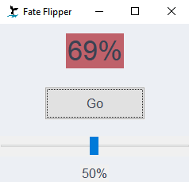

# Fate Flipper

Dumb random number generator made with Tkinter.

## Useage

Clone and run with `python app.py`, or use the `fate_flipper.bat` if on Windows, or write a shell script if on Mac/Linux.

Use the slider to set a threshold value. If the random number is less than the threshold, then the background will be green:

If the random number is greater than the threshold, then the background will be red:

